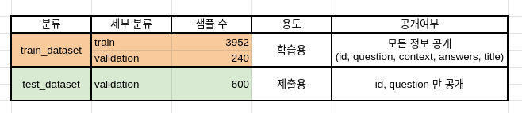
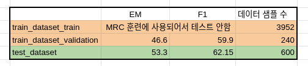
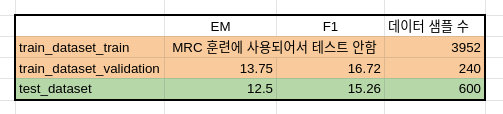

# Readme

## 소개

P stage 3 대회를 위한 베이스라인 코드 

## 설치 방법

### 요구 사항

```
# data (51.2 MB)
tar -xzf data.tar.gz

# 필요한 파이썬 패키지 설치. 
bash ./install/install_requirements.sh

# mecab 설치. root 계정일시 install_mecab_root.sh 실행
bash ./install/install_mecab.sh
```

## 파일 구성


### 저장소 구조

```bash
./assets/                # readme 에 필요한 이미지 저장
./install/                  # 요구사항 설치 파일 
./data/                  # 전체 데이터. 아래 상세 설명
retrieval.py             # sparse retreiver 모듈 제공 
arguments.py             # 실행되는 모든 argument 가 dataclass 의 형태로 저장되어있음
trainer_qa.py            # MRC 모델 학습에 필요한 trainer 제공.
utils_qa.py              # 기타 유틸 함수 제공 

train.py                 # MRC, Retrieval 모델 학습 및 평가 
inference.py		     # ODQA 모델 평가 또는 제출 파일 (predictions.json) 생성
```

## 데이터 소개

아래는 제공하는 데이터셋의 분포를 보여줍니다.



데이터셋은 편의성을 위해 Huggingface 에서 제공하는 datasets를 이용하여 pyarrow 형식의 데이터로 저장되어있습니다. 다음은 데이터셋의 구성입니다.

```python
./data/         # 전체 데이터
    ./train_dataset/           # 학습에 사용할 데이터셋. train 과 validation 으로 구성 
    ./test_dataset/            # 제출에 사용될 데이터셋. validation 으로 구성 
    ./dummy_dataset/           # 모델이 작동하는지 테스트 할때 사용하는 dummy 데이터셋. train 과 validation 으로 구성 
    ./wikipedia_documents.json # 위키피디아 문서 집합. retrieval을 위해 쓰이는 corpus.
```

data에 대한 argument 는 arguments.py 의 DataTrainingArguments 에서 확인 가능합니다. 

# 훈련, 평가, 추론

### train

train.py 를 실행할 때 mrc 모델과 sparse retrieval 모델의 학습이 모두 진행되도록 만들어두었습니다.  만약 arguments 에 대한 세팅을 직접하고 싶다면 arguments.py 를 참고해주세요. 

```
# 학습 예시 (train_dataset 사용)
python train.py --output_dir ./models/train_dataset --do_train
```

### eval

mrc 모델의 평가는(--do_eval) 따로 설정해야 합니다.  위 학습 예시에 단순히 --do_eval 을 추가로 입력해서 훈련 및 평가를 동시에 진행할 수도 있습니다.

```
# mrc 모델 평가 (train_dataset 사용)
python train.py --output_dir ./outputs/train_dataset --model_name_or_path ./models/train_dataset/ --do_eval 
```

### inference

retrieval 과 mrc 모델의 학습이 완료되면 inference.py 를 이용해 odqa 를 진행할 수 있습니다.

* 학습한 모델의  test_dataset에 대한 결과를 제출하기 위해선 추론(--do_predict)만 진행하면 됩니다. 

* 학습한 모델이 train_dataset 또는 dummy_dataset에 대해서 odqa 성능이 어떻게 나오는지 알고 싶다면 평가(--do_eval)를 진행하면 됩니다.

```
# odqa 실행 (test_dataset 사용)
# wandb 가 로그인 되어있다면 자동으로 결과가 wandb 에 저장됩니다. 아니면 단순히 출력됩니다
python inference.py --output_dir ./outputs/test_dataset/ --dataset_name ./data/test_dataset/ --model_name_or_path ./models/train_dataset/ --do_predict
```

### How to submit

inference.py 파일을 위 예시처럼 --do_predict 으로 실행하면 --output_dir 위치에 predictions.json 이라는 파일이 생성됩니다. 해당 파일을 제출해주시면 됩니다.

### 베이스라인 모델 학습 결과

다음은 MRC 베이스라인 모델의 훈련 결과를 보여줍니다.



다음은 위 MRC 모델을 사용한 ODQA 베이스라인 모델의 결과를 보여줍니다.



## Things to know

1. train.py 에서 sparse embedding 을 훈련하고 저장하는 과정은 시간이 오래 걸리지 않아 따로 argument 의 default 가 True로 설정되어 있습니다. 실행 후 sparse_embedding.bin 과 tfidfv.bin 이 저장이 됩니다. **만약 sparse retrieval 관련 코드를 수정한다면, 꼭 두 파일을 지우고 다시 실행해주세요!** 안그러면 존재하는 파일이 load 됩니다.
2. 모델의 경우 --overwrite_cache 를 추가하지 않으면 같은 폴더에 저장되지 않습니다. 

3. ./outputs/ 폴더 또한 --overwrite_output_dir 을 추가하지 않으면 같은 폴더에 저장되지 않습니다.